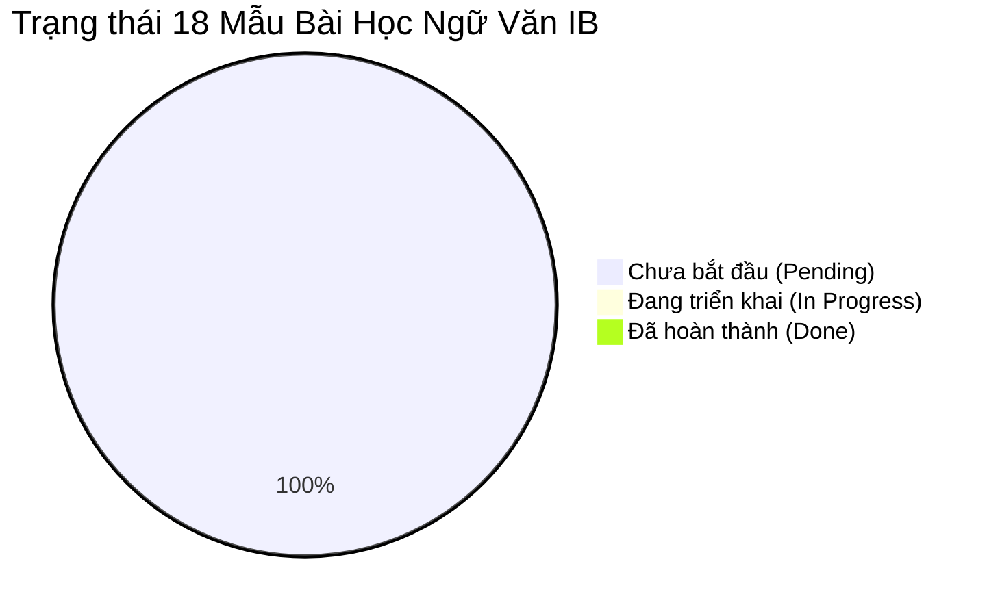

# D4 - Nhật Ký Theo Dõi Tiến Độ Biên Soạn & Kiểm Soát Chất Lượng (Progress Tracking Log)

Tài liệu này dùng để **theo dõi tiến độ thực hiện thực tế**, ghi nhận lịch sử chỉnh sửa, kết quả kiểm tra chất lượng và các ghi chú điều chỉnh cho từng mẫu bài học.

---

## 1. Bảng Trạng Thái Tiến Độ Tổng Quan

- **Tổng số mẫu bài học**: 18
- **Đã hoàn thành (Done)**: 0 / 18
- **Đang triển khai (In Progress)**: 0 / 18
- **Chưa bắt đầu (Pending)**: 18 / 18

---

## 2. Nhật Ký Tiến Độ Chi Tiết 18 Mẫu Bài Học

| Mã Mẫu | Tên Mẫu Bài Học | Người Biên Soạn | Ngày Bắt Đầu | Ngày Hoàn Thành | Trạng Thái | Kiểm Tra Tiêu Chí D2 | Ghi Chú / Phản Hồi |
| :--- | :--- | :--- | :--- | :--- | :--- | :--- | :--- |
| **Mẫu 4.1** | Truyện đồng thoại / Biện pháp Nhân hóa | Antigravity AI | 17/08/2026 | 17/08/2026 | ✅ Done | ✅ Đạt chuẩn D2 & D7 | Đã tạo thành công bài mẫu 2-POV |
| **Mẫu 4.2** | Bài văn miêu tả / Giác quan & Chi tiết | Antigravity AI | -- | -- | ⏳ Pending | ⬜ Chưa duyệt | Trải nghiệm đa giác quan |
| **Mẫu 4.3** | Thơ thiếu nhi / Vần, Nhịp & Cảm xúc | Antigravity AI | -- | -- | ⏳ Pending | ⬜ Chưa duyệt | Nhịp điệu thơ trẻ em |
| **Mẫu 5.1** | Văn bản thông tin / Đa phương thức | Antigravity AI | -- | -- | ⏳ Pending | ⬜ Chưa duyệt | Poster & Kỹ năng KTS |
| **Mẫu 5.2** | Truyện dân gian / Động cơ nhân vật | Antigravity AI | -- | -- | ⏳ Pending | ⬜ Chưa duyệt | Lựa chọn nhân vật |
| **Mẫu 5.3** | Văn tả người / Chi tiết gợi tả | Antigravity AI | -- | -- | ⏳ Pending | ⬜ Chưa duyệt | Tình cảm gia đình |
| **Mẫu 6.1** | Truyện đồng thoại / Điểm nhìn & Bài học | Antigravity AI | -- | -- | ⏳ Pending | ⬜ Chưa duyệt | *Bài học đường đời đầu tiên* |
| **Mẫu 6.2** | Thơ lục bát / Mạch cảm xúc & Vần điệu | Antigravity AI | -- | -- | ⏳ Pending | ⬜ Chưa duyệt | *À ơi tay mẹ* / Thơ mẹ |
| **Mẫu 6.3** | VB Thuyết minh / Cấu trúc & Thông tin | Antigravity AI | -- | -- | ⏳ Pending | ⬜ Chưa duyệt | VB Thuyết minh thắng cảnh |
| **Mẫu 7.1** | Truyện ngụ ngôn / Ẩn dụ tư tưởng | Antigravity AI | -- | -- | ⏳ Pending | ⬜ Chưa duyệt | Truyện ngụ ngôn Việt Nam |
| **Mẫu 7.2** | Thơ 4-5 chữ / Hình ảnh nghệ thuật | Antigravity AI | -- | -- | ⏳ Pending | ⬜ Chưa duyệt | *Mây và sóng* / *Sang thu* |
| **Mẫu 7.3** | VB Nghị luận / Lý lẽ & Dẫn chứng | Antigravity AI | -- | -- | ⏳ Pending | ⬜ Chưa duyệt | *Tinh thần yêu nước...* |
| **Mẫu 8.1** | Truyện hiện thực / Điểm nhìn & Tâm lý | Antigravity AI | -- | -- | ⏳ Pending | ⬜ Chưa duyệt | Phân tích tác phẩm *Lão Hạc* |
| **Mẫu 8.2** | Thơ tự do / Biểu tượng & Ngôn ngữ | Antigravity AI | -- | -- | ⏳ Pending | ⬜ Chưa duyệt | *Đồng chí* (Chính Hữu) |
| **Mẫu 8.3** | Kịch / Xung đột & Hành động ngôn từ | Antigravity AI | -- | -- | ⏳ Pending | ⬜ Chưa duyệt | Kịch *Vũ Như Tô* |
| **Mẫu 9.1** | Truyện trung đại / Bối cảnh & Số phận | Antigravity AI | -- | -- | ⏳ Pending | ⬜ Chưa duyệt | *Chuyện người con gái Nam Xương*|
| **Mẫu 9.2** | Thơ hiện đại / Giọng điệu & Suy tưởng | Antigravity AI | -- | -- | ⏳ Pending | ⬜ Chưa duyệt | *Bếp lửa* (Bằng Việt) |
| **Mẫu 9.3** | VB Nghị luận xã hội / Tư duy phản biện | Antigravity AI | -- | -- | ⏳ Pending | ⬜ Chưa duyệt | Phản biện văn bản đời sống |

---

## 3. Lịch Sử Cập Nhật Hệ Thống Quản Lý

- **17/08/2026**: Khởi tạo thành công bộ 4 tài liệu quản lý D1, D2, D3, D4 tại `/Users/danghong/Documents/pearl/docs/`.
