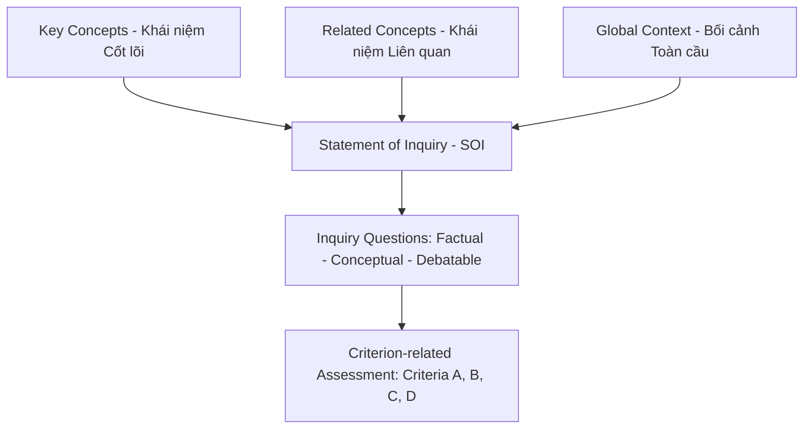

# Research 01: Trường Phái Giáo Dục IB (International Baccalaureate Framework)

Tài liệu nghiên cứu chuyên sâu về triết lý, cấu phần, ví dụ, phản ví dụ và các hiểu lầm phổ biến khi áp dụng **Khung giáo dục IB (Primary Years Programme - PYP & Middle Years Programme - MYP)** vào môn Ngữ Văn.

---

## 1. Cốt Lõi Triết Lý (Core Philosophy)

Trường phái IB (International Baccalaureate) không coi giáo dục là việc truyền thụ một tập hợp tri thức cố định hay luyện học thuộc lòng. Cốt lõi của IB nằm ở:
1. **Phát triển Chân dung Người học (Learner Profile)**: Đào tạo những con người biết truy vấn (Inquirers), có tri thức (Knowledgeable), biết tư duy phản biện (Thinkers), biết giao tiếp (Communicators), và biết thấu cảm (Reflective/Empathetic).
2. **Học qua Khái niệm (Concept-driven)**: Tri thức thực tế (Facts) có thể bị quên hoặc lạc hậu, nhưng **Khái niệm (Concepts)** là chiếc chìa khóa tư duy có thể chuyển giao (transferable) qua nhiều bối cảnh khác nhau.
3. **Văn bản là một Lựa chọn Nghệ thuật (Text as Choice)**: Trong môn *Language & Literature*, văn bản không phải là "kho chứa đáp án" để học sinh đi tìm ý nghĩa tác giả giấu sẵn. Văn bản là kết quả của các **lựa chọn (choices)** về từ ngữ, điểm nhìn, cấu trúc — và nhiệm vụ của học sinh là chỉ ra lựa chọn nào tạo ra hiệu ứng nào.

---

## 2. Các Cấu Phần Bắt Buộc Trong Khung IB

### 2.1. Key Concepts (Khái niệm Cốt lõi)
Là các ý niệm lớn mang tính liên ngành. Trong môn Văn IB có 4 Key Concepts trọng tâm:
- **Perspective (Góc nhìn)**: Người kể quyết định cái gì được thấy và cái gì bị che.
- **Connections (Mối liên hệ)**: Văn bản kết nối với bối cảnh sáng tác, người đọc và các văn bản khác.
- **Creativity (Sáng tạo)**: Lựa chọn ngôn từ phá vỡ lối mòn để tạo hiệu ứng mới.
- **Form (Hình thức)**: Cấu trúc thể loại định hình cách truyền tải thông điệp.

### 2.2. Related Concepts (Khái niệm Liên quan)
Các khái niệm chuyên biệt của môn Văn: *Point of view (Ngôi kể), Purpose (Mục đích), Theme (Chủ đề), Imagery (Hình ảnh nghệ thuật), Tone (Giọng điệu), Style (Phong cách), Context (Bối cảnh).*

### 2.3. Statement of Inquiry (SOI - Tuyên bố Truy vấn)
Là một câu tổng quát thể hiện mối quan hệ giữa **Key Concept + Related Concept trong Bối cảnh Toàn cầu**.
- *Công thức*: `[Key Concept]` + `[Related Concept]` + `[Global Context]` = `SOI`.
- *Ví dụ*: *"Ngôn ngữ hình ảnh (Related Concept) truyền tải được góc nhìn độc đáo (Key Concept) về biểu đạt cá nhân (Global Context)."*

---

## 3. Ví Dụ & Phản Ví Dụ Chuẩn IB

| Hạng mục | ❌ Phản ví dụ (Cách dạy truyền thống/Ngộ nhận IB) | ✅ Ví dụ chuẩn IB (Inquiry & Concept-based) |
| :--- | :--- | :--- |
| **Câu hỏi mở đầu** | *"Hôm nay chúng ta sẽ tìm hiểu ý nghĩa nhân văn của tác phẩm Lão Hạc."* | *"Nếu Nam Cao để Lão Hạc tự kể câu chuyện của mình thay vì qua mắt Ông Giáo, chi tiết nào sẽ biến mất?"* |
| **Vai trò Học sinh** | Ngồi nghe giảng, chép lại các tính từ tả nhân vật do giáo viên đọc. | Đóng vai 4 góc nhìn khác nhau về cùng 1 sự việc để tự rút ra cơ chế của "Điểm nhìn". |
| **Đánh giá** | Chấm điểm dựa trên việc học sinh viết có "đúng ý văn mẫu" hay không. | Chấm theo Rubric 4 tiêu chí (A: Phân tích, B: Bố cục, C: Sáng tạo, D: Ngôn ngữ) dựa trên bằng chứng văn bản. |

---

## 4. Những Ngộ Nhận & Hiểu Lầm Phổ Biến Về IB

1. **Ngộ nhận 1: "Dạy IB là bỏ hết kiến thức SGK Bộ Giáo Dục."**
   - *Sự thật*: IB là một **Khung phương pháp (Framework)** chứ không phải bộ SGK cố định. IB hoàn toàn tích hợp 100% tác phẩm và Yêu cầu cần đạt của Bộ GD&ĐT Việt Nam, chỉ thay đổi cách đặt câu hỏi và cách tiếp cận bài học.
2. **Ngộ nhận 2: "Học sinh IB muốn hiểu tác phẩm thế nào cũng được, không có đúng sai."**
   - *Sự thật*: IB tôn trọng góc nhìn độc lập, nhưng **bắt buộc học sinh phải bảo vệ góc nhìn đó bằng bằng chứng từ chính văn bản** (Criteria A - Analysing). Một cách đọc không có dẫn chứng văn bản sẽ bị điểm kém.
3. **Ngộ nhận 3: "Dạy IB là phải nói tiếng Anh và dùng thuật ngữ phức tạp."**
   - *Sự thật*: Bản chất IB nằm ở tư duy truy vấn. Với học sinh Việt Nam, ngôn ngữ truyền tải phải gần gũi, sinh động nhưng giữ đúng cơ chế tư duy IB.
