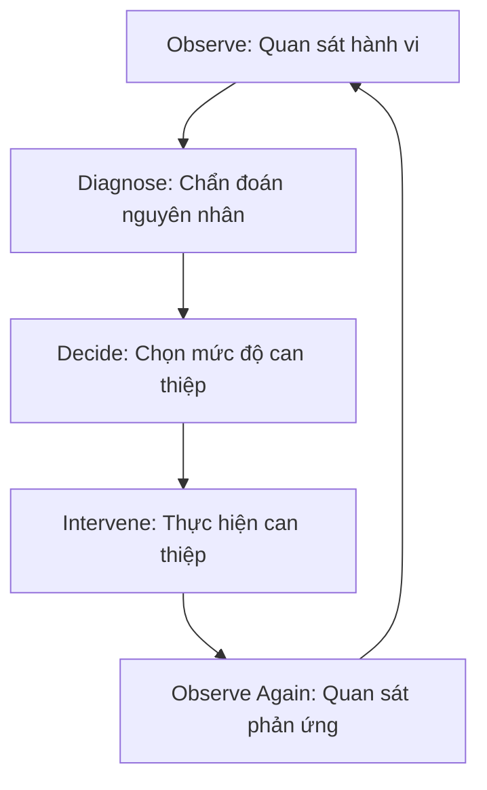

# 2.1 The Mentor Decision Framework

Thuộc [2 · Decision & Intervention Framework](/mentor-guidelines/).

## Trái tim của tài liệu: Chu trình 5 bước

::: pearl-bigidea
**Observe → Diagnose → Decide → Intervene → Observe again**
:::

---

## Decision Rule (Nguyên tắc đèn tín hiệu)

- 🟢 **I KNOW WHAT I WANT TO DO** *(Học sinh có intent và đường đi)* → **Step back** (Lùi lại quan sát).
- 🟡 **I HAVE AN INTENT, BUT I HAVE A GAP** *(Học sinh có mục tiêu nhưng thiếu kiến thức/kỹ năng)* → **Scaffold / Explain** (Gợi mở / Hướng dẫn).
- 🔴 **I DON'T KNOW WHAT I WANT TO DO** *(Học sinh mất định hướng, không intent)* → **Engage again** (Kích hoạt lại nhu cầu học).
